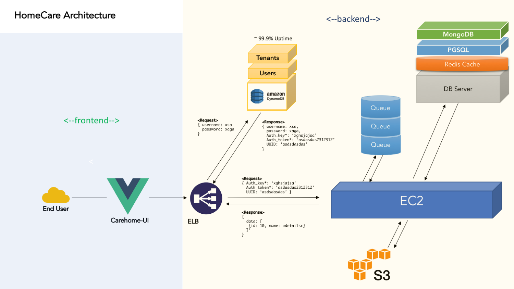

## CareEasy Microservice Architecture


CaseEasy backend architecture has been completely planned on `microservice` as the core `API` exposer.

### Tech stack
- `Node` with `Express` as http server
- Amazon `DynamoDB` for `Master` data persistence `Users` and `Tenants`.
- `MongoDB` 64 bit for internal objects and attributes. 
- `PostGreSQL` was specifically selected due to its features such as `GEO Spatial` support `Transactional` data and `Audit Logs`.
- `Amazon S3` buckets will be used for media assets storage.
- `Redis | Memcache | Casandra` for caching.
- `ELB` Elastic Load Balancer to keep all `API` stateless. 


### Typical Lifecycle of Request

- User request the `api.careeasy.com` with login credentials as `JWT Token` payload. 
- Login route checks for `Authentication` inside dynamoDB users schema and provides a valid `Authorization` with `Auth_Token` and `Auth_Key` as a response to the `Login` request with encryption.

Request:
````
    POST: `api.careeasy.com/auth/login` 

    {
        username: 'demo@gmail.com',
        password: 'demo'
    }
````


JWT(Response):
````
    {
        Auth_key: `7WOPM08FGFJH7ZBDV7MA170HBEWII8RMHQ`,
        Auth_token:`NET91CNKCJ19IV7MA170HBEWII8RMHQ`,
        user: {
            fname: `Jack`,
            lname: `Smith`,
            email: `demo@gmail.com`
            others: {
                education: [],
                experiences: []
            }
            tenants_associated: {
                'logezycare': {
                    'TENANT_UUID': '7MA170H',
                    'DB_NAME': '',
                    'DB_PASSWORD': '',
                    'DB_PORT': '',
                    'DB_USER': '',
                    'Totat_users': 190
                },
                'avantacare': {
                    'TENANT_UUID': '7MA170G',
                    'DB_NAME': '',
                    'DB_PASSWORD': '',
                    'DB_PORT': '',
                    'DB_USER': '',
                    'Totat_users': 2000
                }
            }
        }
    }
````

- Now based out on the `success` of `Authorization` we start communicating with the server tenants only to the given `tenants_associated`. 

### After Authorization
1. Using the given `Auth_Key` and `Auth_Token` and `TENANT_UUID` start sending the request.
2. `ConnectionResolver` Middleware will understand the `Tenant_UUID` header and start establishing connection with the given Tenant. 
  